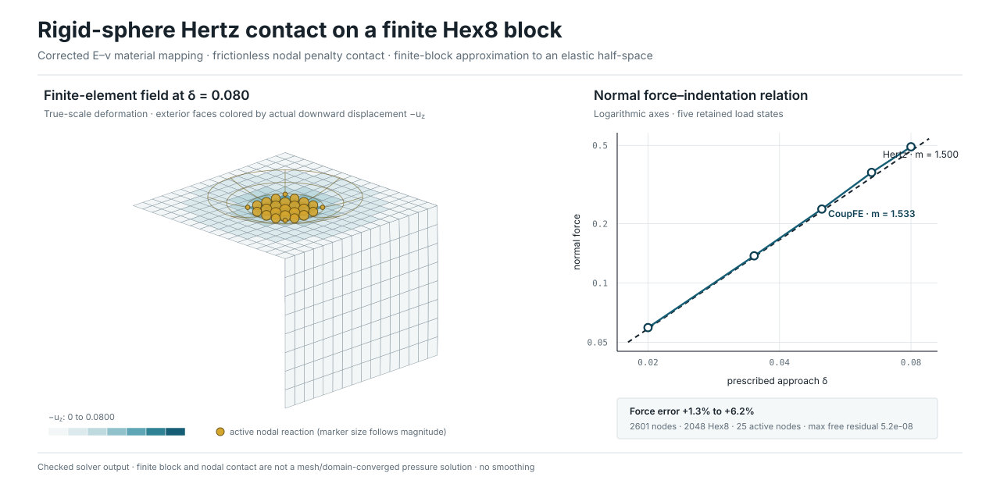

# CoupFE

CoupFE is a small, well-tested **finite-element scaffold**. It is not intended
to replace a general PDE or engineering-analysis platform.

Public overview: <https://tengzhang48.github.io/CoupFE/>. The website presents
the core contracts and scoped evidence; it does not run CoupFE in the browser.

Mature open finite-element frameworks are large for good reason: they provide
broad, reusable support for meshing, boundary conditions, time integration,
I/O, solver integration, and many difficult edge cases. CoupFE explores a
narrower boundary. It keeps a compact, correctness-critical numerical core and
lets each application own its model setup and software adapters.

With the aid of AI coding agents, that application layer can often be developed
and revised quickly. It is still substantive engineering work: assumptions,
units, state transitions, boundary conditions, and data mappings require domain
review and independent tests. CoupFE's validation tools make those checks more
systematic; they do not make generated code correct automatically.

## The idea

> **One operator contract, one native execution path.** Supported element
> formulations run through CoupFE's compiled-element ABI. Selected definitions
> can also be exported as Abaqus/Standard UEL source for external
> interoperability; Abaqus owns and executes that procedure.

CoupFE's serial and PETSc/MPI paths call native compiled elements. A narrow
in-process UEL adapter supports focused implementation-parity checks, not a
general Abaqus analysis. Such parity can detect generation and ABI drift, but
it is not independent validation of the physical model.

## Architecture

Every physical contribution to the global nonlinear system—a bulk element
group, contact set, or load—is an **`Operator`** with one contract:
`residual`, `tangent`, and `commit`. The assembly driver composes operators and
does not need to know their application-specific meaning.

Two disciplines carry most of the design:

- **One residual is the source of truth for supported generated elements.**
  Their smooth tangents are derived with complex-step differentiation. Other
  operators provide separately tested analytic or semismooth tangents.
- **State evaluation and commit are separate operations.** Compiled elements do
  not mutate internal state during residual/tangent evaluation. Generic
  accepted-step orchestration is not yet complete for every driver; the exact
  boundary is recorded in the capability table.

Exact affine constraints use a separate, mesh-agnostic `U = Pq + U0`
transformation. Core provides the numerical contracts and array-level mesh
view; mesh matching, CAD semantics, vendor formats, and application policy stay
in packages such as CoupFE-EDA and CoupFE-Cardiac.

## What is available

The current alpha release includes:

- operator composition, nonlinear increments, implicit dynamics, and reusable
  linear-solver policy;
- compiled f2py native-element execution with explicit joint residual/tangent
  or residual-only evaluation, plus selected Abaqus/Standard UEL source export;
- explicit compiled-element state/commit interfaces and compositional element
  groups;
- serial and PETSc/MPI assembly and solve paths, with the exact support boundary
  recorded in [`docs/capabilities.md`](docs/capabilities.md);
- mesh refinement and distribution primitives over compact array contracts;
- two- and three-dimensional contact building blocks, including barrier search,
  finite-sliding friction, semismooth exact-stick studies, and passing 3-D
  collision/friction examples; and
- a public test and validation approach built around analytic checks, independent oracles,
  broken controls, and clearly labeled implementation-parity tests.

Abaqus UEL and UMAT are external-solver interfaces. CoupFE does not host or call
UMATs in standalone solves; the retained UMAT examples are source-export and
material-point verification records, not CoupFE simulations.

The examples deliberately include both small introductory cases and scoped
research demonstrations. They cover nonlinear elasticity, coupled forms,
inelastic material declarations, curved geometry, contact, and distributed
execution. Affine constraints are covered by the public tests rather than a
standalone example. See [`examples/README.md`](examples/README.md) for
entry points and [`examples/REFERENCES.md`](examples/REFERENCES.md) for the
evidence and attribution boundary.

## A quantitative contact check



The retained Hertz example compares a real `16 × 16 × 8` Hex8 contact solve
with the rigid-sphere force law. Its five-point force error is `+1.3%` to
`+6.2%`, and its fitted log-log exponent is `1.533` versus the analytic `1.500`.
The field panel shows the true-scale deformed mesh and actual nodal contact
reactions; it does not imply a reconstructed pressure field. See the
[`hertz_contact` example](examples/hertz_contact/README.md) for the setup,
reproduction command, and finite-block/mesh limitations.

No mesh-software dependency or general-purpose mesh adapter is part of Core.
For example, the morphing case contains a narrow, read-only extractor for a
user-supplied Abaqus mesh; it is not a general Abaqus input translator.

## Quick start

> Use one consistent conda-forge PETSc/MPI stack for PETSc, MPI, and f2py work;
> do not mix unrelated PETSc and MPI installations. See
> [`docs/install.md`](docs/install.md).

```bash
pip install -e ".[dev,runtime,codegen,performance]"
python -m pytest -q -m "not slow"

python examples/linear_bar/run.py
python examples/neo_hookean_block/run.py
python examples/curved_annulus/run.py
python examples/hertz_contact/run.py
```

MPI examples additionally require the matched PETSc/MPI environment:

```bash
mpirun -n 4 python examples/mpi_smoke/distributed_solve.py
```

Long reproductions are opt-in with `python -m pytest -q -ra -m slow` and may
need external software or user-supplied data. The references ledger identifies
which results are analytic validation, implementation consistency, research
demonstrations, or external reproduction workflows.

The compact public website has no frontend build dependency:

```bash
python .github/scripts/check_site.py
python -m http.server 8000 --directory site
```

The site checker ties displayed example results to `site/evidence.json`, the
source-pinned simulation hashes, separately identified presentation-artifact
hashes, repository links, project metadata, and explicit claim boundaries.
When Git history is available, it also verifies that every source hash can be
recovered from the commit named by the evidence record.

## AI-assisted development

The [`skills/`](skills/) directory contains project-specific guidance that an
AI coding agent or human contributor can use when adding an operator, material,
solver path, or example. It emphasizes provenance, independent oracles, broken
controls, transactional state, and reproducible verification. The intended
workflow is collaborative: an agent can accelerate implementation and review,
while domain experts remain responsible for the formulation and the meaning of
the evidence.

## Project status and history

CoupFE is an active alpha project and a first public demonstration of this
architecture, not a claim of complete FE coverage or real-device validation.
The current, claim-bounded inventory is
[`docs/capabilities.md`](docs/capabilities.md); the design and public API are in
[`docs/DESIGN.md`](docs/DESIGN.md) and [`docs/api.md`](docs/api.md).

CoupFE's declarative source-generation code in `coupfe.codegen` was mechanically
ported from the maintainer's
[`abaqus_ufl`](https://github.com/tengzhang48/abaqus_ufl) project and subsequently
extended with CoupFE's native element ABI. Its declaration style inherits
conceptual inspiration from UFL, but CoupFE neither depends on nor implements
UFL. The public tree keeps a curated set whose provenance and tests are
documented. The broader research direction is summarized in
[`docs/porting.md`](docs/porting.md) and [`docs/roadmap.md`](docs/roadmap.md);
detailed dated plans remain available in Git history without being presented
as current capability.

Maintained by Teng Zhang and contributors.

## Citation and credits

Cite CoupFE itself using [`CITATION.cff`](CITATION.cff), including the exact
version or commit used. CoupFE does not currently have a dedicated paper. Work
that materially uses the generated-element path should additionally cite the
submitted `abaqus_ufl` manuscript and public software; work using the
ppf-derived contact paths should additionally cite `ppf-contact-solver` and
the relevant method paper. [`CREDITS.md`](CREDITS.md) gives the complete role-specific references
and makes the Abaqus, UFL/FEniCSx, `abaqus_ufl`, and contact boundaries
explicit.

## License

Source code, generated source, examples, and configuration are licensed under
the [Apache License 2.0](LICENSE), except for the identified paper-example
ports retained under their
[MIT license](LICENSE-ABAQUS-UFL-EXAMPLES). Documentation prose and figures are
licensed under
[Creative Commons Attribution 4.0 International](LICENSE-DOCS.md); code
snippets embedded in the documentation may also be used under Apache-2.0. See
[NOTICE](NOTICE) for legal attribution, third-party provenance, and trademark
notes; see [`CREDITS.md`](CREDITS.md) for scientific and software citations.
